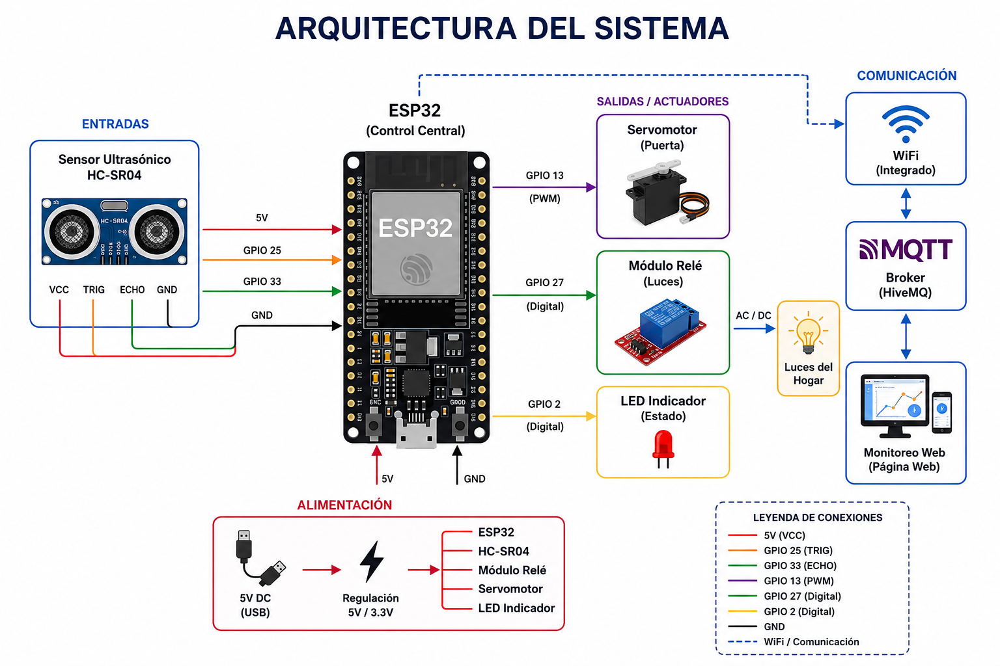
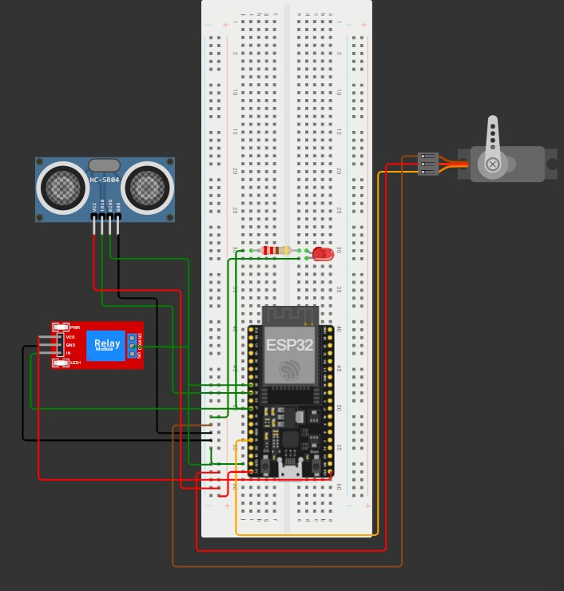

# Casa Inteligente LED Puerta 

## Integrantes

* Saray Duarte
* Hollman Estevez
* María Hormiga
* Rosaura León Rodríguez
* Zabdi Martínez
* Noah Pérez
  
## Descripción del Proyecto

El proyecto que llevamos a cabo es una maqueta de una casa inteligente basada en ESP32. El objetivo principal consiste en que algunas de las funciones de la casa se ejecuten de manera automática mediante el uso de sensores y dispositivos de control.

La primera función es el control de las luces. Para ello no se utiliza ningún sensor, sino que el encendido y apagado se realiza de forma remota desde una página web conectada al ESP32 mediante WiFi. Desde esa página, el usuario puede activar el módulo relé que enciende o apaga las luces decorativas de la maqueta.

La segunda de las funciones es una puerta de garaje automática. En este caso se utiliza un sensor ultrasónico HC-SR04 que mide la distancia de los objetos que se aproximan. Cuando detecta un objeto a una distancia determinada, el ESP32 se encarga de activar un servomotor para abrir la puerta del garaje.

Con este proyecto se persigue el objetivo de aplicar aspectos trabajados en clase como la programación de microcontroladores, el uso de sensores y el control de actuadores.

## Problema Identificado

Hoy en día existen muchas tareas dentro de una vivienda que continúan haciéndose de forma manual. Aunque se consideren acciones sencillas, en algunos casos esto puede resultar una molestia y puede llegar a suponer un tiempo perdido.

Por ejemplo, la persona que quiere encender una luz sin tener que levantarse o estar físicamente cerca del interruptor, o la persona que llega a casa y necesita abrir una puerta de garaje. Por esta razón, ya que se producen situaciones cotidianas donde se requiere comodidad y control a distancia, surge la necesidad de automatizar estos procesos.

## Objetivo General

Diseñar y construir una maqueta de casa inteligente basada en ESP32 que automatice el control de la iluminación interior mediante una página web conectada por WiFi y un módulo relé, así como la apertura de la puerta del garaje mediante sensor ultrasónico HC-SR04 y servomotor, demostrando la aplicación de sistemas embebidos en soluciones domóticas de bajo costo.

## Objetivos Específicos

- Programar el ESP32 para alojar una página web que permita controlar de forma remota, mediante WiFi, el encendido y apagado de las luces decorativas de la maqueta a través de un módulo relé.
- Integrar el sensor ultrasónico HC-SR04 para medir la distancia y activar el servomotor que simula la apertura y cierre automático de la puerta del garaje.
- Programar el ESP32 para gestionar ambos sistemas de forma simultánea e independiente utilizando el lenguaje de programacion en el entorno de desarrollo correspondiente.
- Ensamblar todos los componentes (protoboard, HC-SR04, servomotor, relé, resistencias, luces decorativas, ESP32 y cables jumper) en la estructura física del proyecto.
- Validar el correcto funcionamiento del prototipo mediante pruebas de control remoto vía WiFi y de respuesta del sensor de proximidad en distintas condiciones.
  
## Arquitectura del sistema

### Imagen del diagrama.

# Funcionamiento

## Paso 1: Inicialización del sistema

Cuando el sistema recibe energía:

- El ESP32 se enciende.
- Se configura el sensor ultrasónico.
- Se configura el servomotor.
- Se configura el relé.
- Se activa la conexión WiFi.
- Se establece comunicación con el servidor MQTT.

## Paso 2: Control inteligente de las luces

El usuario accede a una página web desde un computador o dispositivo móvil.

Desde la interfaz puede seleccionar:

### Opción ON

Cuando se presiona **ON**:

- La orden viaja por la red WiFi.
- El mensaje llega al servidor MQTT.
- El ESP32 recibe la instrucción.
- El relé se activa.
- Las luces se encienden.

### Opción OFF

Cuando se presiona **OFF**:

- La orden se envía al servidor MQTT.
- El ESP32 recibe el mensaje.
- El relé cambia de estado.
- Las luces se apagan.

## Paso 3: Detección de proximidad

Mientras el sistema está funcionando, el sensor HC-SR04 realiza mediciones continuas de distancia.

- El sensor envía pulsos ultrasónicos y espera el eco de retorno.
- El ESP32 calcula la distancia utilizando el tiempo que tarda la señal en regresar.

## Paso 4: Apertura automática de la puerta

Cuando un objeto se aproxima a una distancia menor que la establecida:

- El sensor detecta la presencia.
- Envía la información al ESP32.
- El ESP32 verifica que la distancia cumple la condición programada.
- Se genera una señal PWM.
- El servomotor gira.
- La puerta se abre automáticamente.

## Paso 5: Mantenimiento de apertura

Si el sensor continúa detectando presencia:

- La puerta permanece abierta.
- El sistema sigue monitoreando constantemente.
- No se ejecuta el cierre mientras exista un objeto cercano.

## Paso 6: Cierre automático

Cuando el objeto se aleja:

- El sensor deja de detectar presencia.
- Se inicia un temporizador.
- Después del tiempo programado, el ESP32 envía una nueva señal al servomotor.
- El servomotor regresa a su posición inicial.
- La puerta se cierra automáticamente.
  
## Código fuente
El código controla un sistema automatizado basado en un ESP32. Primero se conecta a una red WiFi y a un servidor MQTT para enviar y recibir información en tiempo real. Luego utiliza un sensor ultrasónico para detectar la presencia de un objeto o persona. Cuando la distancia medida es menor a la configurada, el sistema abre una puerta mediante un servomotor y mantiene la puerta abierta si hay presencia. Después de unos segundos sin detectar movimiento, la puerta se cierra automáticamente. Además, el programa permite controlar un relé mediante comandos MQTT, publica el estado del relé, la puerta, la distancia medida y la presencia detectada, e intenta reconectarse automáticamente a la red WiFi y al servidor MQTT en caso de pérdida de conexión.

## Esquema de conexiones

https://wokwi.com/projects/467297961384885249

  
## Pruebas realizadas

| Prueba                    | Descripción                                                                                                                           | Resultado                                                                                                                              |
| ------------------------- | ------------------------------------------------------------------------------------------------------------------------------------- | -------------------------------------------------------------------------------------------------------------------------------------- |
| Reconfiguración del ESP32 | Se formateó nuevamente el ESP32 y se reinstalaron las librerías necesarias debido a una falla de funcionamiento                       | El ESP32 volvió a operar correctamente y permite cargar el programa                                                                    |
| Conexión WiFi y MQTT      | Se verificó la conexión del ESP32 a la red WiFi y al broker MQTT utilizando el código desarrollado                                    | La conexión se estableció correctamente y se logró la comunicación con el broker                                                       |
| Activación del relé       | Se enviaron comandos ON y OFF mediante MQTT para comprobar el control del relé                                                        | El relé respondió correctamente a los comandos recibidos                                                                               |
| Revisión de conexiones    | Se inspeccionaron y ajustaron los cables conectados al relé después de que se desprendieron                                           | Las conexiones quedaron firmes y el sistema volvió a funcionar con normalidad                                                          |
| Prueba de luces           | Se realizaron varios intentos para verificar el funcionamiento de las luces conectadas al relé                                        | Inicialmente las luces no funcionaban debido a que los cables del relé se habían soltado; después del ajuste funcionaron correctamente |
| Prueba del servomotor     | Se realizó una prueba para verificar el funcionamiento del servomotor en la apertura de la puerta                                     | El servomotor respondió a las señales enviadas, pero no contaba con la fuerza suficiente para mover la puerta adecuadamente            |
| Prueba completa           | Se integraron el ESP32, la comunicación MQTT, el relé, las luces y el servomotor para verificar el funcionamiento general del sistema | El sistema funcionó según lo esperado y respondió correctamente a las órdenes enviadas  |

## Estado actual del proyecto

El proyecto se encuentra finalizado. El sistema permite la conexión del ESP32 a la red WiFi y al broker MQTT, además del control del relé mediante comandos remotos. También se completó la integración de los diferentes componentes del prototipo, incluyendo las luces y el servomotor, verificando su funcionamiento mediante diversas pruebas. Tras realizar los ajustes necesarios en el software, las conexiones eléctricas y los dispositivos utilizados, el sistema logró operar de manera satisfactoria y cumplir con los objetivos planteados para el proyecto.

## Dificultades encontradas

Durante el desarrollo se presentaron algunos inconvenientes técnicos. Inicialmente, el ESP32 presentó fallas de funcionamiento, por lo que fue necesario formatear la placa e instalar nuevamente las librerías requeridas. También se registraron problemas eléctricos que afectaron temporalmente las pruebas del sistema. Adicionalmente, el módulo relé presentó dificultades para realizar correctamente el cambio de estado (switch), situación que fue solucionada mediante ajustes en las conexiones y pruebas de funcionamiento.

Otra dificultad encontrada fue que los cables conectados al relé, que debían permanecer sujetos mediante tornillos, se desprendían con facilidad. Esto ocasionó fallas en el funcionamiento de las luces y fue necesario volver a ajustar y asegurar las conexiones.

Por último, se observó que el servomotor utilizado no tenía la fuerza suficiente para abrir la puerta de manera eficiente, lo que limitó parcialmente su funcionamiento durante las pruebas.

Una vez realizadas estas correcciones, el sistema operó de manera satisfactoria.

## Mejoras Futuras

- Control por aplicación móvil: aprovechar las capacidades WiFi y Bluetooth del ESP32 para controlar las luces y el garaje desde un smartphone.
- Iluminación por zonas con sensores PIR: separar la iluminación por habitaciones e instalar sensores de movimiento en cada zona para mayor eficiencia energética.
- Panel de estado con pantalla LCD: añadir una pantalla LCD u OLED que muestre en tiempo real el estado del sistema (luces encendidas/apagadas, puerta abierta/cerrada, distancia detectada).
- Sistema de alertas con buzzer: implementar una alarma sonora cuando la puerta del garaje permanezca abierta por demasiado tiempo o se detecte un evento inusual.
- Cámara de seguridad: incorporar una pequeña cámara en el garaje que capture imágenes al detectar proximidad y las envíe al celular del usuario.
- Alimentación con energía solar: alimentar el sistema con un panel solar y batería recargable para hacerlo más eficiente y sostenible.

## Conclusiones

- **Automatización accesible:** Logramos diseñar y construir con éxito la maqueta funcional de la casa inteligente. Este proceso nos demostró que es totalmente viable usar tecnología económica y sistemas embebidos para transformar tareas del hogar que antes se hacían de forma manual en procesos automáticos orientados al confort.

- **El valor de probar y corregir:** La etapa de pruebas fue fundamental para que el proyecto saliera adelante. Gracias a los ensayos constantes pudimos detectar y solucionar a tiempo fallas con el software, la necesidad de reinstalar librerías y los problemas de conexión con el módulo relé.

- **Lecciones del hardware real:** Aunque el servomotor reaccionaba bien a las señales de proximidad, no tuvo el torque o la fuerza suficiente para levantar la puerta del garaje de manera eficiente. Este inconveniente nos dejó un gran aprendizaje técnico: en ingeniería es vital calcular correctamente las cargas mecánicas antes de elegir los componentes.

- **De la teoría a la práctica:** Desarrollar este prototipo nos ayudó a consolidar los conocimientos adquiridos en la materia. Pudimos integrar la programación de sistemas embebidos, la lectura de sensores y el control de actuadores, logrando que todo el sistema funcionara de acuerdo con los objetivos planteados.
